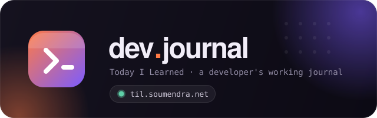
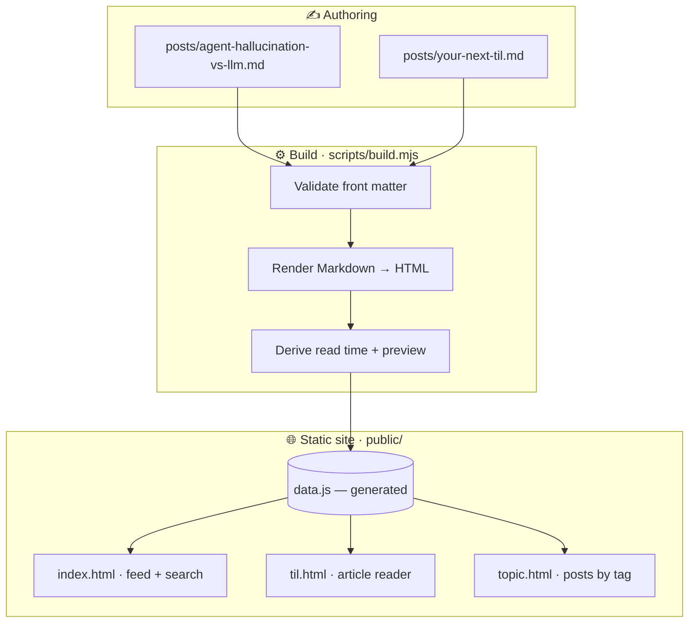
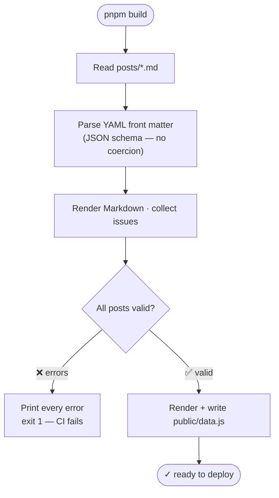
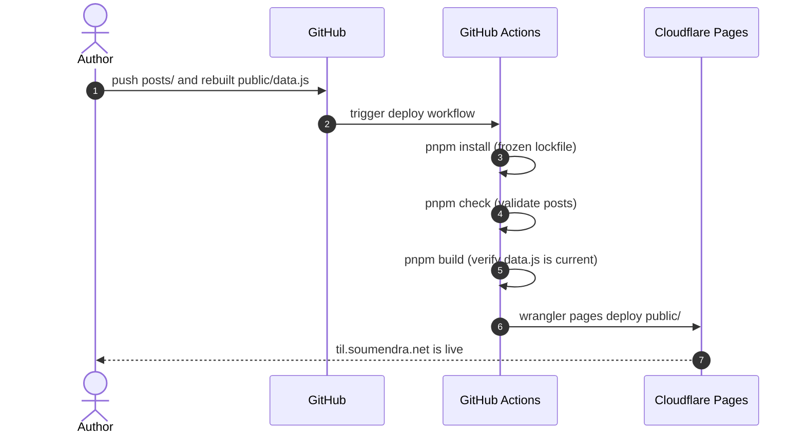

<div align="center">



<h1></h1>

**A working journal of things learned — written down so they don't have to be relearned.**

Short, searchable developer notes on AI observability, infrastructure, and the tools in between.

<br/>

[](https://github.com/soumendrak/til/actions/workflows/deploy.yml)
[](https://til.soumendra.net)


<sub>

[**Live site**](https://til.soumendra.net) · [Write a post](#-writing-a-til) · [Architecture](#-architecture) · [Local development](#-local-development)

</sub>

</div>

---

## ✨ Highlights

- 📝 **Markdown-first authoring** — every post is one `.md` file with YAML front matter. No hand-written HTML, no hand-edited data files.
- 🛡️ **Build-time validation** — a malformed post (bad date, missing field, duplicate slug) fails CI with a precise error and never reaches production.
- ⚡ **Zero-runtime-dependency site** — pure HTML, CSS, and vanilla JS. Nothing to hydrate, nothing to bundle.
- 🧮 **Smart defaults** — reading time and preview text are derived automatically from the post body.
- 🎨 **Editorial design system** — light / dark themes, an accent palette, and a typographic scale shared across pages.
- 🔍 **Instant client-side search**, a frequency-sized tag cloud, and a dedicated page per topic.
- 🚀 **Push-to-deploy** — every commit to `main` is validated, built, and shipped to Cloudflare Pages.

## 🗺️ Architecture

Posts are the single source of truth. The build turns them into one generated
data file that the static pages read — the site never touches Markdown directly.



## ⚙️ How the build works

`scripts/build.mjs` reads every file in `posts/`, validates it, renders the
Markdown, and writes `public/data.js`. Front matter is parsed with the YAML
JSON-schema so values are never silently coerced — a junk date like
`2026-13-99` is **rejected**, not quietly rolled into a valid one.



> `public/data.js` is **generated** — never edit it by hand. Run `pnpm build`
> and commit it alongside the post that changed. CI fails if it is stale.

## 📁 Project structure

```text
TIL/
├── posts/                   # ← write TILs here · one Markdown file per post
│   ├── README.md            #   post format & field reference
│   └── *.md
├── public/                  # static site — deployed as-is
│   ├── index.html           #   feed · search · tag cloud
│   ├── til.html             #   single-post reader
│   ├── topic.html           #   posts filed under one tag
│   ├── app.js               #   shared helpers — theme, colors, escaping
│   ├── style.css            #   design system
│   └── data.js              #   GENERATED — built from posts/, committed
├── scripts/
│   ├── build.mjs            # validate posts → generate data.js
│   └── serve.mjs            # minimal static server for local preview
├── assets/
│   └── logo.svg
├── .agents/skills/til-writer/
│   └── SKILL.md             # authoring guide for AI agents
├── .github/workflows/
│   └── deploy.yml           # CI — validate, build, deploy
└── package.json
```

## ✍️ Writing a TIL

Create one Markdown file in `posts/`. The filename is the slug and the URL.

```markdown
---
title: Agent hallucination vs traditional LLM hallucination
date: 2026-05-20
tags: [llm, observability]
read: 2
preview: One or two sentences with the core takeaway.
---

The post body in **Markdown** — headings, code fences, lists, links and
blockquotes all render on the article page.
```

| Field     | Required | Rules |
|-----------|:--------:|-------|
| `title`   | ✅ | Sentence case, no trailing period, ≤ 80 chars |
| `date`    | ✅ | Real `YYYY-MM-DD` calendar date |
| `tags`    | ✅ | Non-empty list, each tag lowercase kebab-case (1–3 ideal) |
| `read`    | — | Whole minutes 1–30 · auto-estimated from word count if omitted |
| `preview` | — | ≤ 280 chars · auto-derived from the first paragraph if omitted |

The build **fails** on a missing required field, an invalid date, a
non-kebab-case slug or tag, a duplicate slug, an empty body, or Markdown that
will not render. See [`posts/README.md`](posts/README.md) for the full
reference and [`.agents/skills/til-writer/SKILL.md`](.agents/skills/til-writer/SKILL.md)
for the agent authoring guide.

## 🚀 Local development

> Use **pnpm** or **bun** — never npm.

```bash
pnpm install        # one-time — fetch build dependencies
pnpm check          # validate every post (no files written)
pnpm build          # regenerate public/data.js
pnpm dev            # build, then serve at http://localhost:8787
```

## 🌐 Deployment

Pushing to `main` triggers GitHub Actions, which validates and builds before
Cloudflare Pages publishes `public/`. A failing post blocks the deploy.



## 🧰 Tech stack

| Layer            | Choice |
|------------------|--------|
| Posts            | Markdown + YAML front matter |
| Build            | Node 20 · [`marked`](https://marked.js.org) · [`gray-matter`](https://github.com/jonschlinkert/gray-matter) · [`js-yaml`](https://github.com/nodeca/js-yaml) |
| Site             | Vanilla HTML / CSS / JavaScript — no framework, no bundler |
| Package manager  | pnpm |
| Hosting          | Cloudflare Pages |
| CI / CD          | GitHub Actions |

## 👤 Author

Built and written by **[Soumendra Kumar Sahoo](https://www.soumendrak.com)**.

<sub>© 2026 Soumendra Kumar Sahoo · post content is the author's own.</sub>
