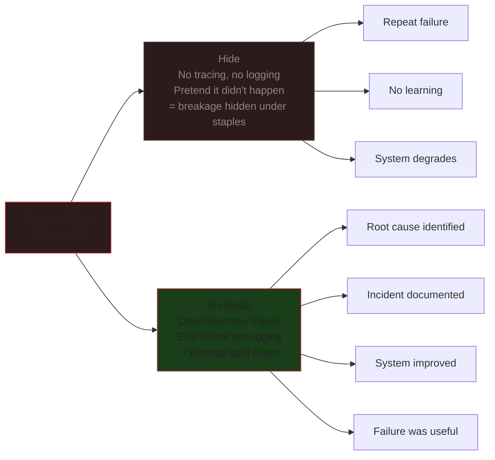

## What is Kintsugi

Kintsugi (金継ぎ, "golden joinery") is the Japanese art of repairing broken pottery with urushi lacquer dusted with powdered gold. The crack is not hidden — it is highlighted. The repaired bowl is often considered more valuable than the original because the gold seam makes it structurally unique: no two breaks are the same.[^1]

The philosophy draws on wabi-sabi: imperfection and impermanence are not flaws to conceal but realities to embrace.[^2]

## Why not hide the crack?

The common explanation ("it's about history") is sentimental and incomplete. Four deeper reasons:

| Question | Surface answer | Deeper truth |
|----------|---------------|--------------|
| "Why not hide the crack?" | "It's about history" | Urushi lacquer is structurally tougher than clay — the gold seam is physically the strongest part of the vessel[^1] |
| "Doesn't 'like new' make it last longer?" | "Perfection is temporary" | A perfect-looking bowl gets wrapped and shelved. A visible crack frees the object for daily use — no illusion to protect[^2] |
| "Isn't history just sentiment?" | "The crack tells a story" | The seam makes the object **irreplaceable** — no factory can replicate a unique break pattern |
| "Doesn't hiding protect the object?" | "Honesty is moral" | Hiding requires a permanent lie. Visible repair eliminates performance anxiety entirely |

## How this maps to AI observability

An AI agent fails in production. You have two responses:

**Hide the crack** — treat the failure as an exception, patch the immediate symptom, move on. No trace, no logging enhancement, no postmortem. The system looks "unbroken" but the underlying fragility remains.

**Fill with gold** — instrument the failure: capture the trace, log the token usage, record the tool calls, run an eval on the output, write a postmortem. The failure becomes visible, named, and analyzed.

This is the exact structural parallel to Kintsugi:

A team that hides failures never builds institutional knowledge. Every incident is a surprise. A team that illuminates failures — with traces, evals, and observability infrastructure — turns every break into a gold seam. The system becomes stronger at the repaired point, and the knowledge is permanent.[^3]

## The personal version

The same principle applies to a career narrative. Presenting an unbroken facade (everything went perfectly, every move was planned) creates fragility — one crack in the story and the whole thing looks suspect. A Kintsugi narrative (here's where I broke, here's what I filled it with) has nothing to hide.

---

[^1]: Wikipedia, "Kintsugi," https://en.wikipedia.org/wiki/Kintsugi, verified 2026-07-04. Covers the philosophy, the three joinery styles, and urushi lacquer materials.

[^2]: Wikipedia, "Wabi-sabi," https://en.wikipedia.org/wiki/Wabi-sabi, verified 2026-07-04. Andrew Juniper: wabi-sabi brings "a sense of serene melancholy and a spiritual longing." Richard Powell: "Nothing lasts, nothing is finished, and nothing is perfect."

[^3]: Widescope project, soumendrak/widescope, https://github.com/soumendrak/widescope, verified 2026-07-04. WASM-based LLM trace viewer — a tool that makes agent failures visible rather than hiding them.
